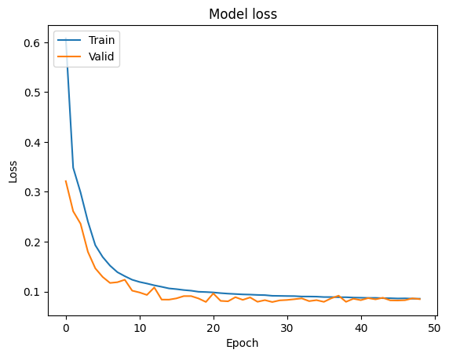
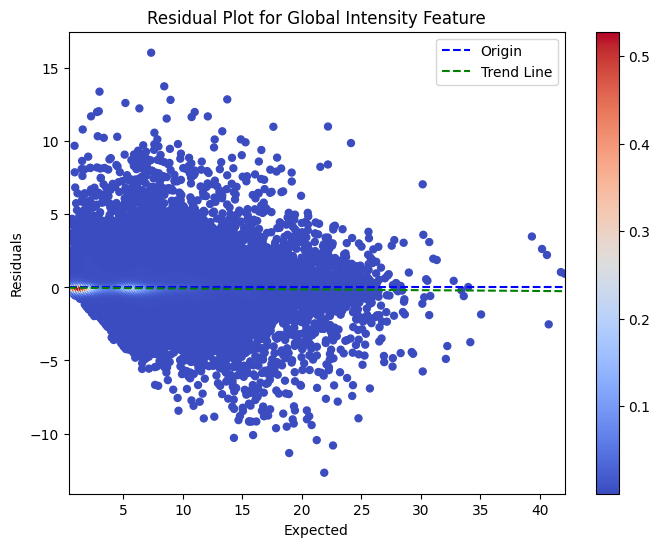
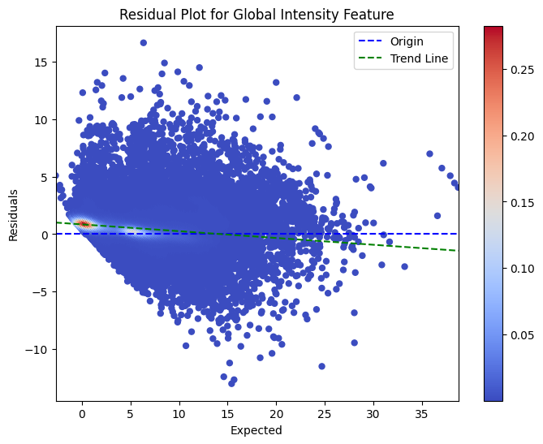

Implementing an Electric Consumption Forecasting Deep Learning Model
==============================
This is a submission for the **ProgressSoft** recruitment process (machine learning division).

It contains the code necessary to implement deep learning models, including LSTM and transformer, to forecast power
consumption with uncertainty.


Getting Started
------------

Clone the project from GitHub and install the necessary dependencies.

The notebook was executed on Jupyter using <ins>**Python 3.10**</ins>.

**TensorFlow** needs to be installed with **Keras** API (preferably utilizing GPU acceleration "CUDA-enabled").

```shell
git clone https://github.com/tariqshaban/progresssoft-electric-consumption-forecast
cd progresssoft-electric-consumption-forecast
pip install -r requirements.txt
```

> [!IMPORTANT]
> It is highly recommended to install the dependency on an isolated Python virtual environment to prevent version
> resolving failures with other projects. Refer to this [documentation](https://docs.python.org/3/library/venv.html)


Dataset
------------

The [Individual Household Electric Power Consumption](https://doi.org/10.24432/C58K54) dataset was used to extract
insight and train the model.

### Citation

    @misc{individual_household_electric_power_consumption_235,
      author       = {Hebrail, Georges and Berard, Alice},
      title        = {{Individual Household Electric Power Consumption}},
      year         = {2006},
      howpublished = {UCI Machine Learning Repository},
      note         = {{DOI}: https://doi.org/10.24432/C58K54}
    }

### Sample

|    Date    |   Time   | Global_active_power | Global_reactive_power | Voltage | Global_intensity | Sub_metering_1 | Sub_metering_2 | Sub_metering_3 |
|:----------:|:--------:|:-------------------:|:---------------------:|---------|:----------------:|:--------------:|:--------------:|:--------------:|
| 16/12/2006 | 17:24:00 |        4.216        |         0.418         | 234.84  |       18.4       |      0.0       |      1.0       |      17.0      |
| 16/12/2006 | 17:25:00 |        5.360        |         0.436         | 233.63  |       23.0       |      0.0       |      1.0       |      16.0      |
| 16/12/2006 | 17:26:00 |        5.374        |         0.498         | 233.29  |       23.0       |      0.0       |      2.0       |      17.0      |
| 16/12/2006 | 17:27:00 |        5.388        |         0.502         | 233.74  |       23.0       |      0.0       |      1.0       |      17.0      |
| 16/12/2006 | 17:28:00 |        3.666        |         0.528         | 235.68  |       15.8       |      0.0       |      1.0       |      17.0      |

2075259 rows × 9 columns

The dataset includes seven features along with date and time columns. Each column appears to have a different numerical
distribution; normalization is probably required to ensure faster convergence.


Preprocessing
------------

* `Date` and `Time` columns are merged into a single `DateTime` column
* Identify and handle NaNs by performing the following:
    * If a valid record exists before and after one year, the mean value the two is calculated and used instead of the
      null record
    * If a valid record exists only before one year, that value is used instead of the null record
    * If a valid record exists only after one year, that value is used instead of the null record
* Additional metadata has been included to add semantics when training the model, such features include:
    * `year`: applied as-is
    * `month`: split into sin and cos of a cycle of 12 to preserve the cyclical nature
    * `day`: split into sin and cos of a cycle of 31 to preserve the cyclical nature
    * `hour`: split into sin and cos of a cycle of 24 to preserve the cyclical nature
    * `minute`: split into sin and cos of a cycle of 60 to preserve the cyclical nature
    * `is_holiday`: a flag which signifies whether that day was a holiday or not, the feature took into consideration
      the holidays of France, since the records originated from a house in the outskirts of Paris

Exploratory Data Analysis
------------

The following plots are a visual representation of the dataset after carrying out the aforementioned preprocessing
steps:

> 
>
> The distribution indicates an often right-skewness in some features, especially in `is_holiday`, where it is heavily
> right-skewed.

> 
>
> The boxplot suggests that `Sub Metering 1`, `Sub Metering 2`, and `is_holiday` features have nearly zero-length
> interquartile range and whiskers, indicating that the data spread (excluding outliers) is too small.

> 
>
> The monthly-averaged feature values in the line plot specify that August observed the least amount of power
> consumption indicators.

> 
>
> The time series plot represents the fluctuation of the features in the whole timeframe, indicating that
> the `is_holiday` feature is set to true in a very few days throughout the years.

Model Training
------------

### Hardware Specifications

The following table indicates the hardware used to train the models:

| Hardware | Specification                       |
|----------|-------------------------------------|
| CPU      | AMD Ryzen 5 3600                    |
| GPU      | Nvidia GeForce RTX 2060 (6 GB VRAM) |
| RAM      | 48 GB DDR4                          |

### Software Specifications

The following table indicates the software and main packages used to train the models:

| Hardware   | Specification                 |
|------------|-------------------------------|
| OS         | Windows 10 build version 22H2 |
| CUDA       | Version 11.8                  |
| CUDNN      | Version 9.0                   |
| Python     | Version 3.10                  |
| TensorFlow | Version 2.10.1                |
| Keras      | Version 2.10.0                |

### Pretraining Operations

The following operations were carried out before the training process:

* Apply a standard scalar as a standardization measure on all features before training for faster convergence; the
  scalar is then inverted after finishing the training process to retain the original numerical representation
* Split the dataset into training, validation, and testing subsets
* Implement the sliding window scheme to segment the training data into overlapping sequential samples of length _N_

### Hyperparameters

The following lists the hyperparameters used to train the model:

| Hyperparameter                  | Value |
|---------------------------------|-------|
| Training Ratio                  | 90%   |
| Validation Ratio                | 5%    |
| Testing Ratio                   | 5%    |
| Sliding Window Stride           | 168   |
| LSTM Hidden Neuron Count        | 200   |
| LSTM Dropout Probability        | 20%   |
| Transformer Number of Heads     | 4     |
| Transformer Hidden Neuron Count | 200   |
| Transformer Dropout Probability | 20%   |
| Batch Size                      | 1024  |
| Epochs                          | 100   |
| Early Stopping Patience         | 20    |

Results
------------

The table displays the results obtained from the constructed LSTM and transformer models:

| LSTM | Global Active Power | Global Reactive Power | Voltage  | Global Intensity | Sub Metering 1 | Sub Metering 2 | Sub Metering 3 |
|------|---------------------|-----------------------|----------|------------------|----------------|----------------|----------------|
| MSE  | 0.0400364           | 0.0018144             | 0.353852 | 0.752957         | 2.52786        | 1.78328        | 2.12156        |
| MAE  | 0.0832064           | 0.0234545             | 0.440743 | 0.375582         | 0.303174       | 0.371407       | 0.660462       |
| R2   | 0.956642            | 0.861756              | 0.969213 | 0.954293         | 0.927462       | 0.93541        | 0.971564       |

| Transformer | Global Active Power | Global Reactive Power | Voltage  | Global Intensity | Sub Metering 1 | Sub Metering 2 | Sub Metering 3 |
|-------------|---------------------|-----------------------|----------|------------------|----------------|----------------|----------------|
| MSE         | 0.0864579           | 0.00252043            | 0.774465 | 1.59928          | 5.85815        | 3.59529        | 3.58714        |
| MAE         | 0.199256            | 0.0299829             | 0.680897 | 0.844541         | 1.18484        | 0.87704        | 1.10333        |
| R2          | 0.906369            | 0.807963              | 0.932617 | 0.902918         | 0.831899       | 0.869778       | 0.95192        |

The metrics indicate that the LSTM model obtained better results on all features and evaluation metrics, which is
probably caused by having a relatively primitive transformer model with many fewer trainable parameters (approximately
14 times fewer than LSTM).

### Convergence Plots

<table>
   <tr>
      <td style="text-align:center">
         <h3 style="padding: 0px;">LSTM</h3>
         
      </td>
      <td style="text-align:center">
         <h3 style="padding: 0px;">Transformer</h3>
         
      </td>
   </tr>
</table>

### Residual Plots

<table>
   <tr>
      <td style="text-align:center">
         <h3 style="padding: 0px;">LSTM</h3>
      </td>
      <td style="text-align:center">
         <h3 style="padding: 0px;">Transformer</h3>
      </td>
   </tr>
   <tr>
      <td style="text-align:center">
         <h4 style="padding: 0px;">Global_active_power</h4>
         
      </td>
      <td style="text-align:center">
         <h4 style="padding: 0px;">Global_active_power</h4>
         
      </td>
   </tr>
   <tr>
      <td style="text-align:center">
         <h4 style="padding: 0px;">Global_reactive_power</h4>
         
      </td>
      <td style="text-align:center">
         <h4 style="padding: 0px;">Global_reactive_power</h4>
         
      </td>
   </tr>
   <tr>
      <td style="text-align:center">
         <h4 style="padding: 0px;">Voltage</h4>
         
      </td>
      <td style="text-align:center">
         <h4 style="padding: 0px;">Voltage</h4>
         
      </td>
   </tr>
   <tr>
      <td style="text-align:center">
         <h4 style="padding: 0px;">Global_intensity</h4>
         
      </td>
      <td style="text-align:center">
         <h4 style="padding: 0px;">Global_intensity</h4>
         
      </td>
   </tr>
   <tr>
      <td style="text-align:center">
         <h4 style="padding: 0px;">Sub_metering_1</h4>
         
      </td>
      <td style="text-align:center">
         <h4 style="padding: 0px;">Sub_metering_1</h4>
         
      </td>
   </tr>
   <tr>
      <td style="text-align:center">
         <h4 style="padding: 0px;">Sub_metering_2</h4>
         
      </td>
      <td style="text-align:center">
         <h4 style="padding: 0px;">Sub_metering_2</h4>
         
      </td>
   </tr>
   <tr>
      <td style="text-align:center">
         <h4 style="padding: 0px;">Sub_metering_3</h4>
         
      </td>
      <td style="text-align:center">
         <h4 style="padding: 0px;">Sub_metering_3</h4>
         
      </td>
   </tr>
</table>

### Time Series Forecasting Plots

<table>
   <tr>
      <td style="text-align:center">
         <h3 style="padding: 0px;">LSTM</h3>
      </td>
      <td style="text-align:center">
         <h3 style="padding: 0px;">Transformer</h3>
      </td>
   </tr>
   <tr>
      <td style="text-align:center">
         <h4 style="padding: 0px;">Power</h4>
         
      </td>
      <td style="text-align:center">
         <h4 style="padding: 0px;">Power</h4>
         
      </td>
   </tr>
   <tr>
      <td style="text-align:center">
         <h4 style="padding: 0px;">Voltage</h4>
         
      </td>
      <td style="text-align:center">
         <h4 style="padding: 0px;">Voltage</h4>
         
      </td>
   </tr>
</table>

### Time Series Forecasting with Uncertainty Plots

<table>
   <tr>
      <td style="text-align:center">
         <h3 style="padding: 0px;">LSTM</h3>
      </td>
      <td style="text-align:center">
         <h3 style="padding: 0px;">Transformer</h3>
      </td>
   </tr>
   <tr>
      <td style="text-align:center">
         <h4 style="padding: 0px;">Global_active_power</h4>
         
      </td>
      <td style="text-align:center">
         <h4 style="padding: 0px;">Global_active_power</h4>
         
      </td>
   </tr>
   <tr>
      <td style="text-align:center">
         <h4 style="padding: 0px;">Global_reactive_power</h4>
         
      </td>
      <td style="text-align:center">
         <h4 style="padding: 0px;">Global_reactive_power</h4>
         
      </td>
   </tr>
   <tr>
      <td style="text-align:center">
         <h4 style="padding: 0px;">Voltage</h4>
         
      </td>
      <td style="text-align:center">
         <h4 style="padding: 0px;">Voltage</h4>
         
      </td>
   </tr>
   <tr>
      <td style="text-align:center">
         <h4 style="padding: 0px;">Global_intensity</h4>
         
      </td>
      <td style="text-align:center">
         <h4 style="padding: 0px;">Global_intensity</h4>
         
      </td>
   </tr>
   <tr>
      <td style="text-align:center">
         <h4 style="padding: 0px;">Sub_metering_1</h4>
         
      </td>
      <td style="text-align:center">
         <h4 style="padding: 0px;">Sub_metering_1</h4>
         
      </td>
   </tr>
   <tr>
      <td style="text-align:center">
         <h4 style="padding: 0px;">Sub_metering_2</h4>
         
      </td>
      <td style="text-align:center">
         <h4 style="padding: 0px;">Sub_metering_2</h4>
         
      </td>
   </tr>
   <tr>
      <td style="text-align:center">
         <h4 style="padding: 0px;">Sub_metering_3</h4>
         
      </td>
      <td style="text-align:center">
         <h4 style="padding: 0px;">Sub_metering_3</h4>
         
      </td>
   </tr>
</table>

--------